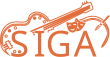

  

 

# Sistema de Gestão de Associados (SIGA)

Sistema web desenvolvido para o Grupo Cultural de Dom Maurício, com o objetivo de modernizar e centralizar a gestão dos associados da instituição. A plataforma substitui o controle manual de informações e implementa a emissão de carteirinha digital em formato PDF.

O principal produto entregue pelo software é a Carteira do Associado em formato PDF, possuindo numeração única e todos os dados necessários para identificação dos associados.

---

## Perfis de Utilizadores

O sistema atende a quatro perfis distintos de usuários:

**Administrador** - Possui controle total sobre o sistema, incluindo criação de cadastros, consulta, atualização, renovação de vínculos de associados e disparo de mensagens por e-mail.

**Consultor** - Perfil com acesso restrito a consulta de dados dos associados, sem permissões de edição.

**Associado** - Acessa o sistema de forma simplificada através de um token seguro enviado por e-mail. Pode consultar e complementar suas informações pessoais, além de visualizar e baixar sua carteirinha.

**Visitante (público externo)** - Pode verificar a validade e autenticidade das carteirinhas geradas pelo sistema através de uma página pública de validação.

## Tecnologias Utilizadas

### Front-end

- React
- TypeScript
- Material UI (MUI) 9
- React Router DOM
- Axios
- Vite

### Back-end

- Java
- Spring Boot
- PostgreSQL
- JWT
- iText
- Swagger / OpenAPI

### Infraestrutura

- Docker e Docker Compose
- Nginx

---

## Equipe de Desenvolvimento

| Nome           | Papel                   |
| -------------- | ----------------------- |
| Julio Morais   | Product Owner           |
| Cícero Higor   | UX                      |
| Pablo Vinicios | QA                      |
| Rodrigo        | Desenvolvedor Back-End  |
| Randson Silva  | Desenvolvedor Front-End |

---

## Licença

Copyright (c) 2026 Grupo Cultural de Dom Maurício. Todos os direitos reservados.

Este software é de propriedade exclusiva do Grupo Cultural de Dom Maurício e seus desenvolvedores. Nenhuma parte deste software, incluindo seu código-fonte, documentação e ativos visuais, pode ser copiada, modificada, distribuída, sublicenciada, vendida ou utilizada de qualquer forma sem autorização prévia e expressa por escrito dos detentores dos direitos autorais.

O uso não autorizado deste software constitui violação de direitos autorais e está sujeito às penalidades previstas na legislação brasileira vigente.
